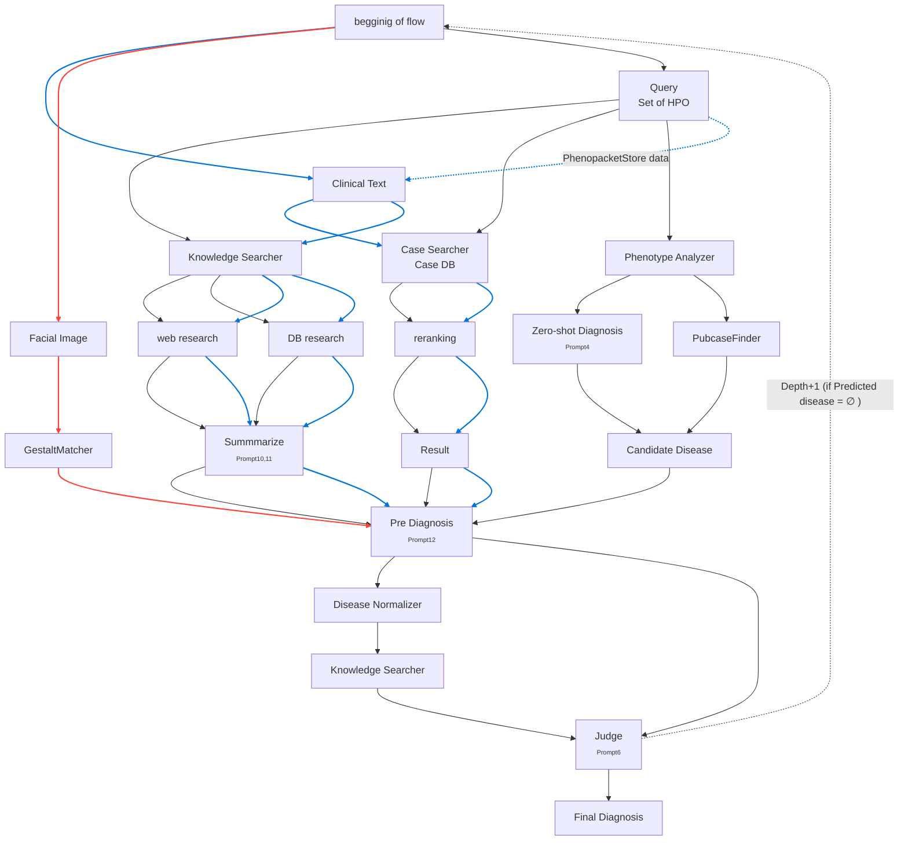

# zebraseek

## フロー図（Mermaid記法）

# Research Question

1. Which is more effective for identifying similar patient cases and relevant medical information: free-form clinical narratives or standardized HPO annotations?

2. Are facial photographs effective for diagnosing rare diseases?

# Rare Disease Diagnosis Agent(Now developping)

## Purpose
This project implements an AI agent for assisting in the diagnosis of rare diseases.

---

## Features (Implemented)
- **PCF Integration:** Calls the PubCaseFinder (PCF) API for case-based retrieval.
- **Zero-Shot Diagnosis:** Utilizes zero-shot learning for disease suggestion.
- **Tentative Diagnosis:** Generates a preliminary diagnosis based on input data.
- **Reflection Step:** Performs a reflection process to refine diagnostic suggestions.
- **Final Diagnosis:** Outputs a final diagnosis after all reasoning steps.

---

## Features (Not Yet Implemented)
- **MCP Server Integration:** Support for MCP server communication.
- **External Knowledge Search Logic:** Mechanism for searching and integrating external knowledge sources.
- **Memory:** Persistent memory for accumulating and utilizing information across sessions.
- **Information Definition & Prompt Integration:** Clear definition of information types and mechanisms for embedding them into prompts.

---

## Notes
- Further development is needed for memory management and external knowledge integration.
- Contributions and suggestions are welcome!